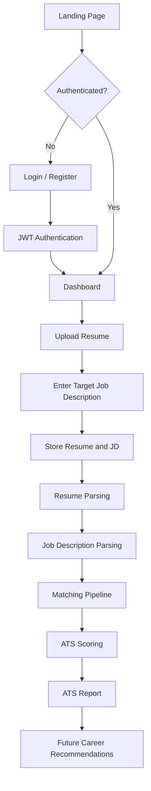
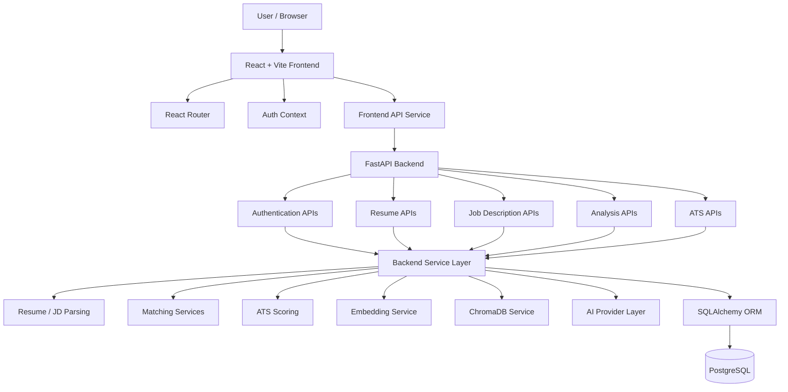
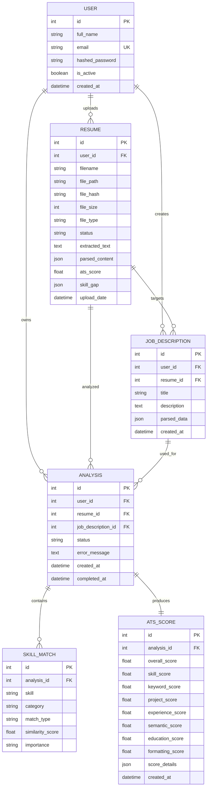
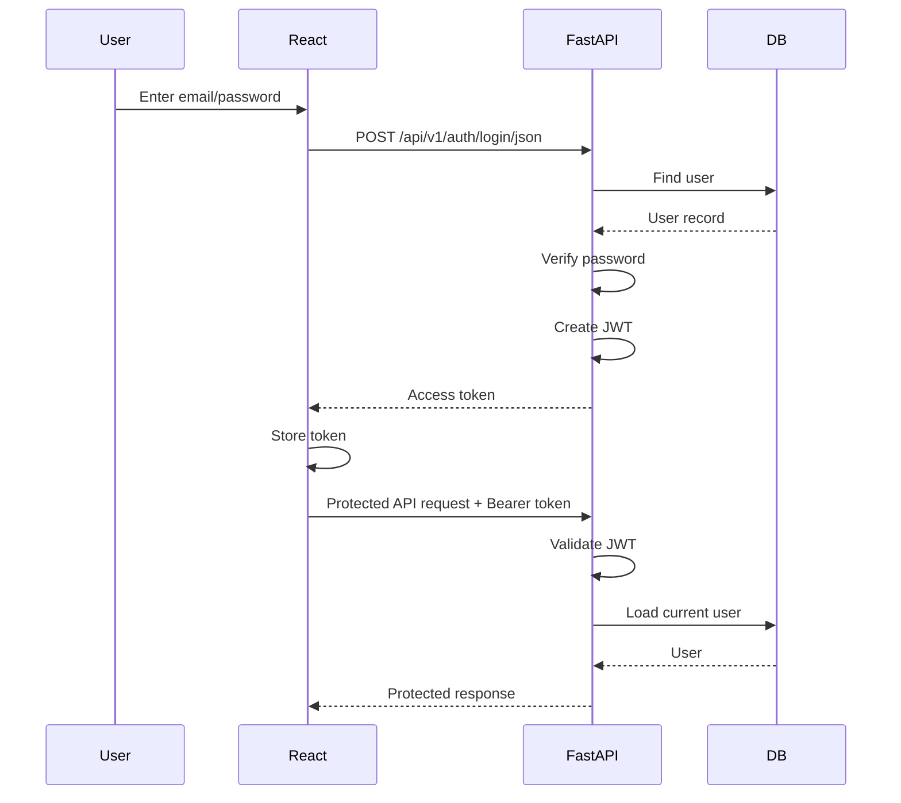
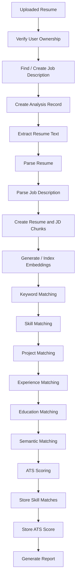
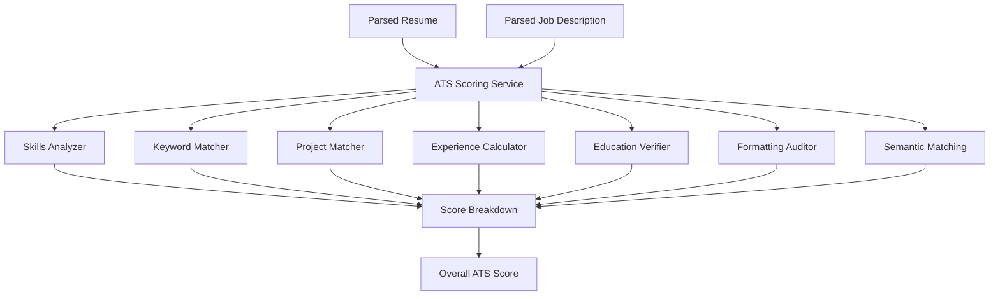
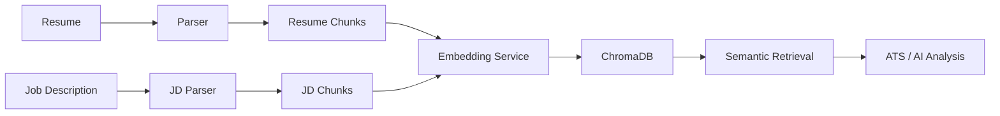
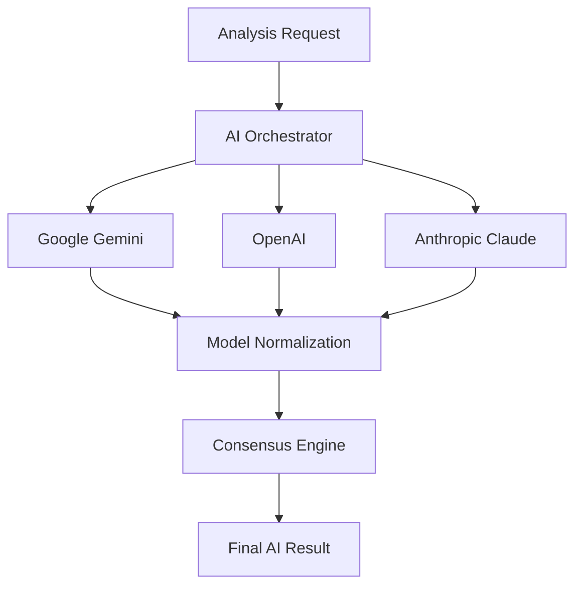

# SkillForge AI

> **AI-Powered Resume Analysis, ATS Evaluation & Career Guidance Platform**

SkillForge AI is an academic mini-project designed to help students understand how well their resume matches a target job description and identify areas for improvement. The project combines a modern web application with resume parsing, structured job-description analysis, semantic matching, ATS scoring, vector search, and AI-assisted recommendations.

The repository currently contains a **React + Vite frontend** and a **FastAPI backend**. The backend uses **SQLAlchemy** for ORM/database access and **Alembic** for schema migrations, with PostgreSQL support. The codebase also contains the foundations for **Sentence Transformers, ChromaDB, and multi-model AI providers** for the later stages of the project.

---

## 1. Project Overview

### Problem

Students often have difficulty determining:

- Whether their resume is suitable for a particular job.
- Which skills required by a job are missing from their resume.
- How well their resume may perform in an ATS.
- Whether their projects and experience align with a target role.
- What they should improve before applying.

Traditional keyword-based checking is limited because equivalent skills and related concepts may be expressed differently.

### Proposed Solution

SkillForge AI accepts a user's resume and a target job description and processes them through a pipeline that can:

1. Authenticate the user.
2. Upload and store the resume.
3. Store the target job description.
4. Extract and parse resume content.
5. Parse job-description requirements.
6. Generate semantic representations.
7. Compare resume content with job requirements.
8. Calculate an ATS score with multiple scoring dimensions.
9. Present the results through a dashboard.
10. Provide a foundation for future AI-powered career recommendations.

---

# 2. Main Features

## Current/Implemented Features

- User registration
- User login
- JWT authentication
- Protected frontend routes
- Resume upload
- PDF/DOCX resume support
- Resume file-size validation
- Resume duplicate detection using SHA-256
- Resume text extraction
- Structured resume parsing
- Job-description creation and storage
- Job-description parsing
- Analysis pipeline
- ATS scoring pipeline
- Skill matching
- Keyword matching
- Project matching
- Experience matching
- Education matching
- Semantic matching
- ATS score breakdown
- Analysis history
- Resume details
- ATS report pages
- React-based dashboard
- FastAPI Swagger/OpenAPI documentation

## AI/Advanced Components Present in the Backend

The codebase also contains services for:

- Google Gemini
- OpenAI provider abstraction
- Anthropic/Claude provider abstraction
- Multi-model orchestration
- Sentence Transformer embeddings
- ChromaDB vector storage
- Semantic similarity
- Deterministic ATS scoring
- Consensus-based model normalization

These components form the foundation for progressively expanding the project.

---

# 3. Application Flow

The intended user journey is:

```text
Landing Page
     |
     v
Login / Register
     |
     v
Authenticated Dashboard
     |
     v
Upload Resume + Target Job Description
     |
     v
Resume & JD Stored
     |
     v
Resume Parsing
     |
     v
Job Description Parsing
     |
     v
Semantic / Keyword / Skill Matching
     |
     v
ATS Scoring
     |
     v
ATS Report
     |
     v
Future: Skill Gap + Roadmap + Interview Preparation
```

### Mermaid User Flow



---

# 4. System Architecture

SkillForge AI follows a layered full-stack architecture.



---

# 5. Technology Stack

| Layer | Technology | Purpose |
|---|---|---|
| Frontend | React 18 | UI development |
| Frontend Tooling | Vite 6 | Development server and build tool |
| Routing | React Router DOM | Client-side routing |
| Icons | Lucide React | UI icons |
| Backend | FastAPI | REST API development |
| ASGI Server | Uvicorn | Runs FastAPI |
| Validation | Pydantic 2 | Request/response validation |
| Configuration | Pydantic Settings | Environment-based configuration |
| ORM | SQLAlchemy 2 | Database interaction |
| Migration | Alembic | Database schema versioning |
| Database | PostgreSQL | Persistent relational storage |
| Authentication | JWT | Token-based authentication |
| Password Security | Passlib + bcrypt | Password hashing |
| File Upload | python-multipart | Multipart/form-data handling |
| Resume Parsing | pypdf / python-docx | Document extraction |
| Embeddings | Sentence Transformers | Semantic vector representations |
| Vector Database | ChromaDB | Vector storage and retrieval |
| LLM | Google Gemini | AI-assisted analysis |
| Additional AI Providers | OpenAI / Anthropic | Provider abstraction/future multi-model support |
| API Testing | HTTPX / Postman | API testing |
| Version Control | Git / GitHub | Source control |

---

# 6. Repository Structure

```text
skillforgeAI-main/
│
├── backend/
│   ├── app/
│   │   ├── api/
│   │   │   ├── deps.py
│   │   │   └── endpoints/
│   │   │       ├── auth.py
│   │   │       ├── resumes.py
│   │   │       ├── jobdescription.py
│   │   │       ├── analysis.py
│   │   │       └── ats.py
│   │   │
│   │   ├── core/
│   │   │   ├── config.py
│   │   │   └── security.py
│   │   │
│   │   ├── db/
│   │   │   ├── base.py
│   │   │   ├── base_class.py
│   │   │   └── session.py
│   │   │
│   │   ├── models/
│   │   │   ├── user.py
│   │   │   ├── resume.py
│   │   │   ├── job_description.py
│   │   │   ├── analysis.py
│   │   │   ├── ats_score.py
│   │   │   └── skill_match.py
│   │   │
│   │   ├── schemas/
│   │   │   ├── user.py
│   │   │   ├── token.py
│   │   │   ├── resume.py
│   │   │   ├── job_description.py
│   │   │   ├── analysis.py
│   │   │   └── ats.py
│   │   │
│   │   └── services/
│   │       ├── ai/
│   │       ├── ats/
│   │       ├── consensus/
│   │       ├── deterministic/
│   │       ├── embeddings/
│   │       ├── matching/
│   │       ├── nlp/
│   │       ├── parsing/
│   │       └── vector/
│   │
│   ├── alembic/
│   │   └── versions/
│   │
│   ├── requirements.txt
│   ├── alembic.ini
│   └── .env.example
│
├── frontend/
│   ├── src/
│   │   ├── components/
│   │   ├── context/
│   │   ├── layouts/
│   │   ├── pages/
│   │   ├── routes/
│   │   ├── services/
│   │   ├── App.jsx
│   │   ├── index.css
│   │   └── main.jsx
│   │
│   ├── index.html
│   ├── package.json
│   └── package-lock.json
│
└── .gitignore
```

---

# 7. Frontend Architecture

The frontend is a **React + Vite** single-page application.

## Frontend Pages

| Page | Purpose |
|---|---|
| LandingPage | Entry point and project introduction |
| LoginPage | User authentication |
| RegisterPage | New user registration |
| DashboardPage | User dashboard |
| UploadPage | Resume + job-description upload |
| ResumeDetailPage | Resume-specific details |
| AnalysisLoading | Analysis progress/loading view |
| ATSReport | ATS result presentation |

## Frontend Components

- `Navbar.jsx`
- `MainLayout.jsx`
- `ProtectedRoute.jsx`

## State and Authentication

`AuthContext.jsx` manages:

- Current user
- Login
- Registration
- Logout
- Authentication state
- Session initialization

The JWT token is stored in browser local storage under:

```text
skillforge_token
```

---

# 8. Backend Architecture

The backend is implemented entirely using **FastAPI**.

There is no Node.js or Express backend.

## API Layers

```text
HTTP Request
     |
     v
FastAPI Router
     |
     v
Dependency / Authentication
     |
     v
Pydantic Schema Validation
     |
     v
Service Layer
     |
     +----> Parser
     +----> Matching
     +----> ATS
     +----> Embeddings
     +----> AI
     |
     v
SQLAlchemy ORM
     |
     v
PostgreSQL
```

---

# 9. Database Design

The backend currently defines the following primary entities:

- User
- Resume
- JobDescription
- Analysis
- SkillMatch
- ATSScore

### Entity Relationship



---

# 10. Database Migrations

Alembic is used for database schema versioning.

Current migration history includes:

```text
bd37dabbd027
Initial database tables

        ↓

f3c1df3c9181
Add file_hash, file_size and file_type to resume
```

Typical workflow:

```bash
alembic revision --autogenerate -m "describe change"
alembic upgrade head
```

Rollback:

```bash
alembic downgrade -1
```

---

# 11. Authentication Flow

Authentication uses JWT bearer tokens.



---

# 12. Resume Upload and Analysis Pipeline

The main analysis endpoint is:

```text
POST /api/v1/analysis/{resume_id}
```

The pipeline performs the following major operations:



---

# 13. Resume Parsing

The parsing layer contains:

```text
services/parsing/
├── pdf_extractor.py
├── resume_parser.py
└── job_parser.py
```

The unified parser service provides resume text extraction and structured parsing.

The resume parser identifies information such as:

- Personal information
- Skills
- Programming languages
- Frameworks
- Databases
- Tools
- Cloud technologies
- Experience
- Projects
- Education
- Certifications
- Summary/profile information

The parser also contains a known-skill taxonomy and rule-based detection mechanisms.

---

# 14. Job Description Parsing

Job descriptions are represented by:

```text
JobDescription
```

The parser can structure information such as:

```text
Job Information
├── Title
├── Company
├── Experience Required
└── Education Required

Skills
├── Required Skills
├── Preferred Skills
├── Optional Skills
├── Tools
├── Frameworks
├── Databases
└── Cloud

Responsibilities
Qualifications
Keywords
```

The current implementation can use Gemini when available and includes a heuristic fallback parser.

---

# 15. ATS Scoring Architecture

The ATS implementation is not based on a single keyword count.

The backend contains deterministic and semantic analysis services covering multiple dimensions.

Major scoring dimensions exposed by the ATS report include:

- Skill Score
- Keyword Score
- Project Score
- Experience Score
- Semantic Score
- Education Score
- Formatting Score
- Overall Score

### ATS Architecture



---

# 16. Semantic Matching

Semantic matching is implemented through the embedding service.

The project contains support for:

```text
Sentence Transformers
        |
        v
Text Embeddings
        |
        v
Cosine Similarity
        |
        v
Semantic Match Score
```

The implementation also contains a TF-IDF cosine similarity fallback when embedding computation is unavailable.

Semantic comparisons include:

- Resume vs Job Description
- Experience vs Responsibilities
- Projects vs Responsibilities
- Skills vs Required Skills

---

# 17. ChromaDB / Vector Layer

The repository contains a dedicated vector service:

```text
backend/app/services/vector/chroma_service.py
```

and an embedding service:

```text
backend/app/services/embeddings/embedding_service.py
```

The analysis pipeline prepares resume and job-description chunks and indexes them into the vector layer.

The intended architecture is:



The project can therefore evolve from the current relational storage model into a combined:

```text
PostgreSQL
+
ChromaDB
```

architecture.

---

# 18. AI Provider Architecture

The backend contains a provider abstraction for multiple AI models.

```text
services/ai/
├── base_provider.py
├── gemini_provider.py
├── gemini_service.py
├── openai_provider.py
├── claude_provider.py
└── multi_model_orchestrator.py
```

This allows the project to evolve beyond a single-model implementation.

### Conceptual Flow



---

# 19. REST API

Base API path:

```text
/api/v1
```

## Authentication

| Method | Endpoint | Purpose |
|---|---|---|
| POST | `/auth/register` | Register user |
| POST | `/auth/login` | OAuth2-style form login |
| POST | `/auth/login/json` | JSON login used by frontend |
| GET | `/auth/me` | Current authenticated user |

## Resume

| Method | Endpoint | Purpose |
|---|---|---|
| POST | `/resumes/upload` | Upload resume |
| GET | `/resumes/` | Resume history |
| GET | `/resumes/{id}` | Resume details |
| DELETE | `/resumes/{id}` | Delete resume |

## Job Description

| Method | Endpoint | Purpose |
|---|---|---|
| POST | `/jobdescription/` | Create job description |
| GET | `/jobdescription/{id}` | Get job description |
| DELETE | `/jobdescription/{id}` | Delete job description |

## Analysis

| Method | Endpoint | Purpose |
|---|---|---|
| POST | `/analysis/{resume_id}` | Start analysis |
| GET | `/analysis/{resume_id}` | Get analysis |
| GET | `/analysis/{resume_id}/status` | Get analysis status |

## ATS

| Method | Endpoint | Purpose |
|---|---|---|
| GET | `/ats/{resume_id}` | Get ATS score |
| GET | `/ats/{resume_id}/report` | Get full ATS report |

---

# 20. API Documentation

FastAPI automatically generates OpenAPI documentation.

After starting the backend, Swagger UI is available at:

```text
http://127.0.0.1:8000/docs
```

ReDoc is available at:

```text
http://127.0.0.1:8000/redoc
```

OpenAPI JSON:

```text
http://127.0.0.1:8000/api/v1/openapi.json
```

---

# 21. Backend Installation

## Prerequisites

Install:

- Python 3.10+
- PostgreSQL
- Node.js 18+
- npm
- Git

---

## Clone Repository

```bash
git clone <your-github-repository-url>
cd skillforgeAI-main
```

---

## Backend Setup

```powershell
cd backend
```

Create virtual environment:

```powershell
python -m venv venv
```

Activate on PowerShell:

```powershell
.\venv\Scripts\Activate.ps1
```

Install dependencies:

```powershell
pip install -r requirements.txt
```

---

# 22. PostgreSQL Configuration

The current backend configuration supports PostgreSQL through environment variables.

Create:

```text
backend/.env
```

Example:

```env
PROJECT_NAME="SkillForge AI"
API_V1_STR="/api/v1"

SECRET_KEY="replace-with-a-long-random-secret"
ALGORITHM="HS256"
ACCESS_TOKEN_EXPIRE_MINUTES=11520

USE_SQLITE=false

POSTGRES_SERVER=localhost
POSTGRES_PORT=5432
POSTGRES_USER=postgres
POSTGRES_PASSWORD=your_postgres_password
POSTGRES_DB=skillforge_db

GEMINI_API_KEY=""
OPENAI_API_KEY=""
ANTHROPIC_API_KEY=""

CHROMA_PERSIST_DIRECTORY="./chroma_db"
UPLOAD_DIRECTORY="./uploads"
```

### Important

The current source code still contains a **SQLite fallback** when `USE_SQLITE=true` or when PostgreSQL credentials are incomplete.

For the intended PostgreSQL setup, use:

```env
USE_SQLITE=false
```

and provide valid PostgreSQL credentials.

---

# 23. Database Migration

From the backend directory:

```powershell
alembic upgrade head
```

To create a new migration after changing SQLAlchemy models:

```powershell
alembic revision --autogenerate -m "describe schema change"
```

Then:

```powershell
alembic upgrade head
```

---

# 24. Run FastAPI Backend

From:

```text
skillforgeAI-main/backend
```

run:

```powershell
uvicorn app.main:app --reload
```

The backend will normally be available at:

```text
http://127.0.0.1:8000
```

Health/root endpoint:

```text
http://127.0.0.1:8000/
```

Swagger:

```text
http://127.0.0.1:8000/docs
```

### Important

The FastAPI entry point in the current repository is:

```text
backend/app/main.py
```

Therefore the correct Uvicorn module path is:

```text
app.main:app
```

not:

```text
main:app
```

when running from the `backend` directory.

---

# 25. Frontend Installation

Open a second terminal.

```powershell
cd frontend
```

Install dependencies:

```powershell
npm install
```

Run development server:

```powershell
npm run dev
```

Vite will normally provide a local URL such as:

```text
http://localhost:5173
```

---

# 26. Frontend Build

Production build:

```powershell
npm run build
```

Preview production build:

```powershell
npm run preview
```

Lint:

```powershell
npm run lint
```

---

# 27. Running the Complete Application

Use two terminals.

### Terminal 1 — Backend

```powershell
cd backend
.\venv\Scripts\Activate.ps1
uvicorn app.main:app --reload
```

### Terminal 2 — Frontend

```powershell
cd frontend
npm run dev
```

Then open the Vite URL shown in the terminal.

---

# 28. Environment Variables

| Variable | Purpose |
|---|---|
| `PROJECT_NAME` | Application name |
| `API_V1_STR` | API version prefix |
| `SECRET_KEY` | JWT signing key |
| `ALGORITHM` | JWT algorithm |
| `ACCESS_TOKEN_EXPIRE_MINUTES` | Token lifetime |
| `USE_SQLITE` | Current database selection toggle |
| `POSTGRES_SERVER` | PostgreSQL host |
| `POSTGRES_PORT` | PostgreSQL port |
| `POSTGRES_USER` | PostgreSQL user |
| `POSTGRES_PASSWORD` | PostgreSQL password |
| `POSTGRES_DB` | PostgreSQL database |
| `GEMINI_API_KEY` | Gemini API key |
| `OPENAI_API_KEY` | OpenAI API key |
| `ANTHROPIC_API_KEY` | Anthropic API key |
| `CHROMA_PERSIST_DIRECTORY` | ChromaDB persistence path |
| `UPLOAD_DIRECTORY` | Uploaded-file storage path |

**Never commit real API keys, passwords, or production secrets to GitHub.**

---

# 29. Testing

The backend repository includes test files covering areas such as:

```text
test_auth.py
test_complete_ats_pipeline.py
test_e2e_edge_cases.py
test_error_diagnosis.py
test_multi_ai_ats_suite.py
test_resume_upload_and_parse.py
```

Testing areas include:

- Authentication
- Resume upload
- Resume parsing
- ATS pipeline
- Multi-model analysis
- Edge cases
- Error handling
- End-to-end scenarios

Run the test suite if the project environment has the required test dependencies installed:

```powershell
pytest
```

---

# 30. Security Considerations

The application currently includes:

- JWT authentication
- Password hashing
- Protected routes
- User-specific database filtering
- File extension validation
- Maximum resume size validation
- SHA-256 duplicate detection
- Environment-based secret configuration

### Current Upload Limit

Resume uploads are limited to:

```text
10 MB
```

Supported resume formats:

```text
.pdf
.docx
.doc
```

The implementation should be further hardened before production deployment, particularly around secret management, CORS configuration, file-content validation, and persistent file storage.

---

# 31. Development Roadmap

The project is intended to be developed incrementally.

### Phase 1 — Foundation

- React + Vite frontend
- FastAPI backend
- PostgreSQL configuration
- SQLAlchemy models
- Alembic migrations
- JWT authentication
- Landing page
- Login/Register
- Protected dashboard

### Phase 2 — Resume and Job Data

- Resume upload
- Resume validation
- Job-description input
- Job-description storage
- Resume history
- Basic parsing

### Phase 3 — Resume Parsing

- PDF/DOCX extraction
- Section detection
- Skill extraction
- Experience extraction
- Project extraction
- Education extraction
- Structured JSON representation

### Phase 4 — Semantic Layer

- Sentence Transformer embeddings
- Resume chunking
- Job-description chunking
- ChromaDB indexing
- Semantic similarity

### Phase 5 — ATS Engine

- Keyword matching
- Skill matching
- Project matching
- Experience matching
- Education matching
- Formatting analysis
- Semantic score
- Overall ATS score

### Phase 6 — Generative AI

- Gemini integration
- Prompt engineering
- Structured AI responses
- AI-assisted recommendations
- Multi-model orchestration

### Phase 7 — Career Intelligence

- Skill-gap analysis
- Learning roadmap
- Project recommendations
- Interview questions
- Career recommendations

### Phase 8 — Finalization

- Integration testing
- UI refinement
- Performance optimization
- Documentation
- Deployment
- Final presentation
- Viva preparation

---

# 32. Academic Project Timeline

A suggested semester plan is:

| Week | Primary Goal |
|---|---|
| 1 | Requirements + literature survey |
| 2 | Architecture + database design |
| 3 | FastAPI + PostgreSQL + Alembic |
| 4 | Authentication |
| 5 | Resume upload + JD storage |
| 6 | Resume parsing |
| 7 | Embeddings + ChromaDB |
| 8 | ATS engine |
| 9 | Gemini integration |
| 10 | Skill-gap + recommendations |
| 11 | Dashboard integration |
| 12 | Testing + bug fixing |
| 13 | Final integration |
| 14 | Report + screenshots |
| 15 | PPT + viva preparation |
| 16 | Final submission / buffer |

The exact schedule can be adjusted according to the semester calendar and team availability.

---

# 33. Team Development Guidelines

For collaborative development:

### Backend Team

Responsible for:

- FastAPI
- SQLAlchemy
- Alembic
- PostgreSQL
- Authentication
- Parsing
- ATS engine
- AI services

### Frontend Team

Responsible for:

- React/Vite
- Routing
- Authentication UI
- Dashboard
- Upload interface
- ATS report UI

### AI/ML Team

Responsible for:

- Embeddings
- Semantic matching
- ChromaDB
- Gemini
- Prompt engineering
- AI evaluation

### Documentation/Testing

Responsible for:

- Test cases
- API documentation
- Screenshots
- Weekly reports
- Final report
- Presentation

Team members can overlap responsibilities depending on team size.

---

# 34. Design Principles

The project follows these principles:

- Modular architecture
- Separation of concerns
- Reusable services
- API-driven communication
- Database normalization
- Environment-based configuration
- Protected user data
- Incremental development
- Extensible AI architecture

---

# 35. Future Enhancements

Possible future additions include:

- AI-generated personalized learning roadmap
- AI mock interviews
- Voice-based interview analysis
- Resume builder
- Job recommendation engine
- LinkedIn profile analysis
- GitHub project analysis
- Company-specific ATS evaluation
- Resume version comparison
- Skill-progress tracking
- Salary prediction
- Career path recommendation
- Multi-language resume analysis
- Recruiter portal
- Mobile application

---

# 36. Known Development Considerations

The repository is actively evolving. Before production deployment, the following areas should be reviewed:

1. Use a strong randomly generated `SECRET_KEY`.
2. Use PostgreSQL explicitly for the intended project deployment.
3. Restrict CORS from `*` to known frontend origins.
4. Store uploaded files using production-grade object/file storage.
5. Validate actual file content in addition to extensions.
6. Add rate limiting for authentication and AI endpoints.
7. Protect API keys through environment/secret management.
8. Add automated CI testing.
9. Add stronger frontend error/loading states.
10. Review AI-generated output for reliability and consistency.

---

# 37. Academic Project Objective

The primary academic objective of SkillForge AI is to demonstrate the practical integration of:

```text
Full-Stack Development
        +
Database Engineering
        +
Natural Language Processing
        +
Semantic Search
        +
Vector Databases
        +
Large Language Models
        +
REST APIs
        +
Software Engineering
```

The project therefore provides a practical case study of how modern AI systems can be integrated into a full-stack application.

---

# 38. Conclusion

SkillForge AI is designed as an intelligent career-assistance platform that bridges the gap between student resumes and job requirements.

The system combines:

- React
- Vite
- FastAPI
- PostgreSQL
- SQLAlchemy
- Alembic
- JWT
- Resume Parsing
- Sentence Transformers
- ChromaDB
- Gemini
- ATS Scoring
- Semantic Matching

The modular architecture allows the project to be developed incrementally. The current repository already provides the foundation for authentication, resume management, job-description management, parsing, matching, ATS evaluation, semantic processing, and AI-provider integration, while additional career-intelligence features can be added in later phases.

---

# 39. Project Status

**Development Stage:** Active Academic Mini Project

**Architecture:** Full-stack + AI

**Frontend:** React + Vite

**Backend:** FastAPI

**Database:** PostgreSQL-oriented SQLAlchemy architecture

**Migrations:** Alembic

**Authentication:** JWT

**AI/ML:** Gemini + Sentence Transformers + semantic matching

**Vector Layer:** ChromaDB

**Primary Goal:** Resume-to-job matching, ATS evaluation, and intelligent career guidance

---

## License

This project is developed for **academic/educational purposes** as a mini-project.

Add an appropriate open-source license if the project is later intended for public redistribution.

---

## Contributors

Add team members here:

```text
1. Name — Role
2. Name — Role
3. Name — Role
4. Name — Role
```

---

## Repository

Add your GitHub repository URL here:

```text
https://github.com/<username>/<repository>
```
